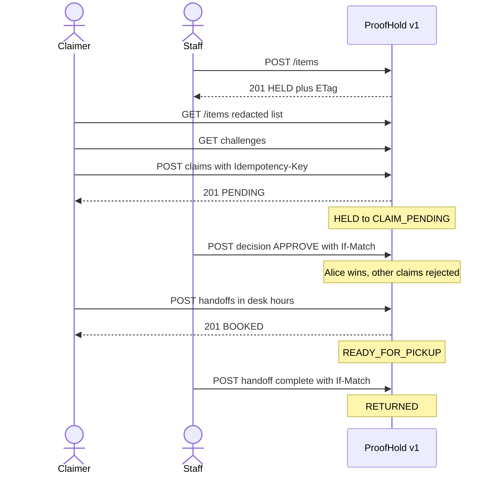

# ProofHold

A lost-and-found desk where owners **prove** an item is theirs without ever seeing the photo.

Public search must not leak enough to fake a claim. That rule is the product.

This repo is a v1 interview project for frontend, backend, REST API, QA, and tester roles. Idea: [IDEA.md](./IDEA.md). Work plan: [WHAT_TO_DO.md](./WHAT_TO_DO.md). Contract: [docs/openapi.yaml](./docs/openapi.yaml).

---

## Demo story

Staff logs: black leather wallet, Library 2nd floor.

Public search shows: Wallet · Library Front Desk · found date · pending claims.

Hidden challenges: *What initials are inside?* and *About how many cards?*

Alice claims. Staff approves. Pickup is booked in desk hours (09:00–17:00 America/New_York). Bob’s pending claim is auto-rejected.

---

## Demo users

Password for all: `proofhold`

| Email | Role |
|---|---|
| staff@proofhold.local | STAFF |
| alice@proofhold.local | CLAIMER |
| bob@proofhold.local | CLAIMER (conflict tests) |

One location: **Library Front Desk**.

---

## How to run

Needs Java 21, Maven, Node, Docker, PostgreSQL on port 5432.

```bash
docker compose up -d postgres
cd backend && mvn test && mvn spring-boot:run
```

API: `http://localhost:8080`

```bash
cd frontend && npm install && npm run dev
```

UI: `http://localhost:5173`

Login as Alice for search + claim wizard. Login as staff for `/staff` (log item, queue, decide, pickup, donate, audit). A claimer hitting `/staff` is blocked in the UI; those routes stay 403 on the API.

Playwright (API + Vite already up):

```bash
cd frontend && npx playwright test
```

---

## Screens to capture (for a README gallery later)

1. Public / claimer search — redacted cards only
2. Claim wizard — questions, no photo
3. Claim submitted — “pending staff review”
4. Empty search and 409 already-verified banners
5. Staff log-item form
6. Staff review — secrets + submitted answers + approve/reject
7. Pickup booking and returned/donated actions
8. Audit timeline

---

## Architecture (happy path)



Redaction uses **separate DTOs** (`PublicItem` vs `StaffItem`), not a shared entity with fields set to null. Optimistic locking: item `version` as `ETag` / `If-Match`. Decisions are `POST /v1/claims/{id}/decision`, not `/approveClaim`.

---

## Limitations (v1)

- No SMS, email vendor, or map
- One desk, not multi-tenant SaaS
- No image ML; photo is an optional URL
- Challenge answers are stored hashed; staff see the **submitted** answers, not the original expected plaintext
- `VERIFIED` / `READY_FOR_PICKUP` are not auto-expired — see [docs/EXPIRY.md](./docs/EXPIRY.md)
- No second microservice, Redis, or Kafka

---

## Interview notes

Practice script: [docs/INTERVIEW.md](./docs/INTERVIEW.md)

| Role | Where to point |
|---|---|
| Frontend | `frontend/src` — redacted cards, claim wizard, 401/409/422, staff routes |
| Backend | `ItemStateMachine`, `ClaimService.decide`, `@Version` |
| REST API | `docs/openapi.yaml`, problem+json, Idempotency-Key, If-Match |
| QA | `qa/TEST_PLAN.md`, `qa/TEST_CASES.md` (P0 leak/authz/idempotency/locking) |
| Tester | `qa/AUTOMATION_MAP.md`, JUnit, `AuthAccessApiTest`, `frontend/e2e/happy-path.spec.ts` |
