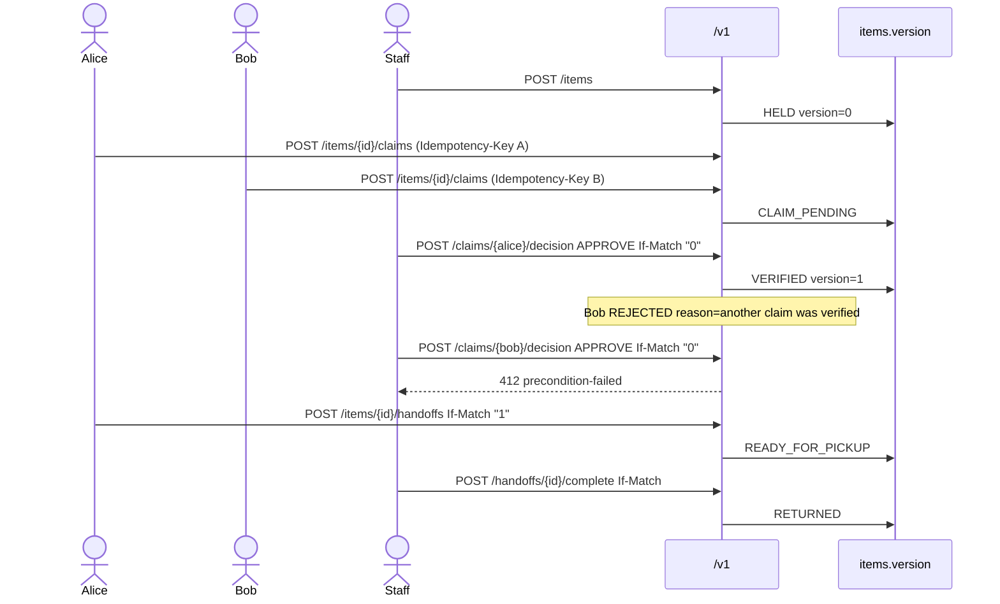

# Sequence — claim → decision → handoff

```mermaid
sequenceDiagram
  actor Alice as Alice
  actor Bob as Bob
  actor Staff as Staff
  participant API as /v1
  participant Item as items.version

  Staff->>API: POST /items
  API->>Item: HELD version=0
  Alice->>API: POST /items/{id}/claims (Idempotency-Key A)
  Bob->>API: POST /items/{id}/claims (Idempotency-Key B)
  API->>Item: CLAIM_PENDING
  Staff->>API: POST /claims/{alice}/decision APPROVE If-Match "0"
  API->>Item: VERIFIED version=1
  Note over API: Bob REJECTED reason=another claim was verified
  Staff->>API: POST /claims/{bob}/decision APPROVE If-Match "0"
  API-->>Staff: 412 precondition-failed
  Alice->>API: POST /items/{id}/handoffs If-Match "1"
  API->>Item: READY_FOR_PICKUP
  Staff->>API: POST /handoffs/{id}/complete If-Match
  API->>Item: RETURNED
```

Also in the root [README.md](../README.md).
